<div align="center">


# Școala de Fotbal Dan Matei

### The digital home of a UEFA-licensed youth football academy in Cluj-Napoca

_Academia care formează fotbaliști — și oameni._
**“The academy that shapes footballers — and people.”**

<br/>

[](https://www.danmatei.ro)
&nbsp;
[](https://www.danmatei.ro/academie)
&nbsp;
[](https://www.danmatei.ro)

<br/>


</div>

<br/>

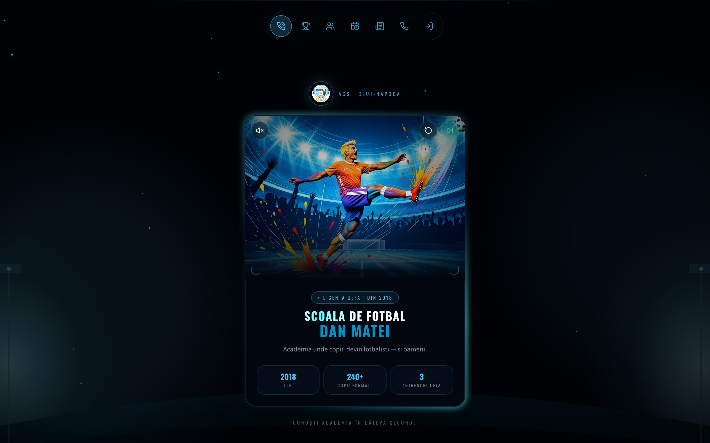

> [!NOTE]
> This is a real, in-production platform for **A.C.S. Școala de Fotbal Dan Matei**. The entire interface is in **Romanian**. It is far more than a marketing site: it is a full **parent ↔ coach operating system** with role-based dashboards, an **AI voice agent that calls new families on WhatsApp**, real-time messaging, scheduling, attendance, player development tracking, and push notifications — all on a single Supabase project and a Vercel deployment.

---

## 📋 Table of Contents

- [About the Academy](#-about-the-academy)
- [What the Platform Does](#-what-the-platform-does)
- [Screenshots](#-screenshots)
- [Signature Feature — AI Lead Calls](#-signature-feature--the-ai-voice-agent)
- [Tech Stack](#️-tech-stack)
- [Architecture](#️-architecture)
- [Project Structure](#-project-structure)
- [Data Model](#-data-model)
- [Getting Started](#-getting-started)
- [Environment Variables](#-environment-variables)
- [Deployment](#-deployment)
- [Scripts](#-scripts)
- [Project Conventions](#-project-conventions)
- [License](#-license)

---

## 🏟️ About the Academy

**Școala de Fotbal Dan Matei** is a youth football academy founded in **2018** in **Cluj-Napoca, Romania**. Its philosophy is simple and is repeated everywhere on the site, in the founder's own words:

> _“Fotbalul nu este doar un joc. Este școala unde copiii învață ce este caracterul, disciplina și respectul în echipă — aceste lucruri îi vor ajuta în viață.”_
>
> **“Football is not just a game. It's the school where children learn character, discipline and respect within a team — things that will help them in life.”**
> — _Dan Matei, Founder & Head Coach_

The academy is built on four values — **Passion · Education · Fair-Play · Professionalism** — and a motto borrowed straight from the training ground: **“Work Hard, Feel Good.”**

<table>
<tr>
<td align="center" width="25%"><h3>2018</h3>Founded</td>
<td align="center" width="25%"><h3>240+</h3>Children trained</td>
<td align="center" width="25%"><h3>3</h3>UEFA coaches</td>
<td align="center" width="25%"><h3>2</h3>Training bases</td>
</tr>
</table>

**🏆 Cupa Transilvaniei × 2** — two consecutive editions won with the U13 group.

### Coaching team

Three UEFA-licensed coaches — _no substitutes, the same team all year round_. Each age group is led by a specialist for that age, not a generalist, with a **maximum of 14 children per group**.

| Coach              | Role                 | Ages    | Licenses                     |
| ------------------ | -------------------- | ------- | ---------------------------- |
| **Dan Matei**      | Head Coach & Founder | U7–U15  | UEFA B · Licență FRF         |
| **Kelemen Andrei** | Coach                | U10–U13 | UEFA C · Antrenor Federal    |
| **Răzvan Soporan** | Coach                | U7–U9   | UEFA C · Pediatric First Aid |

### Age groups & schedule

Children are auto-assigned to the right group and coach by date of birth, and every child plays **one official match per week**.

| Group   | Ages  | Format & focus                                                               | Schedule                  |
| ------- | ----- | ---------------------------------------------------------------------------- | ------------------------- |
| **U7**  | 5–7   | Initiation through play — coordination, first touch, no competitive pressure | Tue & Thu · 16:00–17:00   |
| **U9**  | 8–9   | Basic technique, first 5×5 games, county U9 championship                     | Mon/Wed/Fri · 16:00–17:30 |
| **U11** | 10–11 | 7×7, positioning, first tactical schemes, weekly official match              | Mon–Fri · 17:00–18:30     |
| **U13** | 12–13 | 9×9, position-specific tactics, prep for performance-center selection        | Mon–Fri · 17:30–19:00     |
| **U15** | 14–15 | 11×11 full tactical system, competition mentality                            | Mon–Fri · 18:00–19:30     |

**Two bases in Cluj-Napoca:** Baza Unirea (Mănăștur) · Baza Cotton (Grigorescu) — professional turf, dedicated locker rooms.

### Contact

📞 **0744 311 147** &nbsp;·&nbsp; ✉️ **zzizzou5@yahoo.com** &nbsp;·&nbsp; 📍 Cluj-Napoca &nbsp;·&nbsp; [Facebook](https://www.facebook.com/share/1GEmo1NpaV/) &nbsp;·&nbsp; 🕓 Mon–Fri 16:00–19:00

---

## ✨ What the Platform Does

The app serves **four audiences** from one codebase, with role-based routing and Row-Level Security enforcing who sees what.

### 🌍 Public experience (prospective families)

- **Cinematic landing** (`/`) — a hero card with a stadium-chant video and a 10-second countdown ring that auto-advances into the discovery flow (skippable).
- **“Cunoaște” discovery deck** (`/cunoaste`) — a full-screen swipe deck: **Founder → Coaches → Players**, with touch-swipe, keyboard arrows and an Embla carousel.
- **Marketing pages** — academy story, age groups, tournaments, league standings, news, results, weekly schedule, and a photo/video gallery.
- **Lead capture & instant AI call** (`/programare`) — a parent leaves their details and immediately receives a one-tap WhatsApp link to talk to the academy's AI assistant.

### 👨‍👩‍👧 Parent area

- Google sign-in, profile completion (phone gate), and child onboarding with **automatic coach matching by age**.
- **Child profile** with a 5-dimension skill radar (passing, control, technique, cooperation, discipline), attendance %, match stats, an activity timeline, and a birthday confetti moment 🎉.
- Per-child schedule, training recaps, news and **RSVP for trainings**.

### 🧑‍🏫 Coach area

- Group roster, schedule management, attendance, match results, and **broadcast messaging** to a whole group or a single child.
- **AI lead inbox** — every prospective family's AI phone call arrives transcribed and summarised, with intent, suggested next steps and one-tap call / WhatsApp / schedule actions.

### 🛡️ Owner / Admin

- Invite coaches, manage members, edit landing-page content.
- **Lead-funnel analytics** (charts), at-risk-family detection, news authoring, notification broadcasting and schedule oversight.

### 🤖 Cross-cutting

- **Web Push** notifications, an installable **PWA**, real-time chat & notification updates, and scheduled **cron jobs** (daily birthday + RSVP nudges, a weekly digest).

---

## 📸 Screenshots

<table>
  <tr>
    <td width="50%">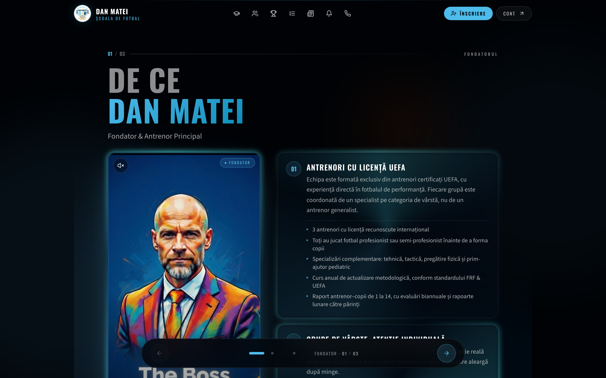<br/><sub><b>“Cunoaște” deck</b> — Founder / Coaches / Players</sub></td>
    <td width="50%">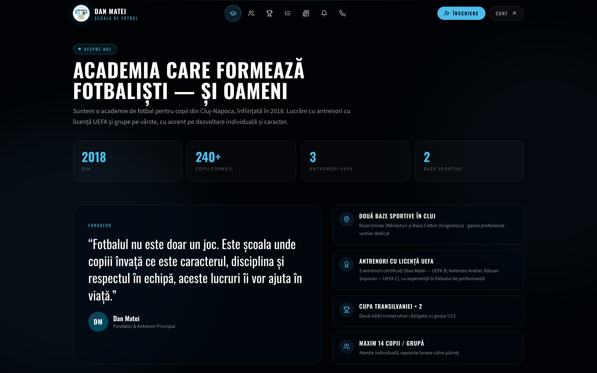<br/><sub><b>Academy</b> — story, stats & achievements</sub></td>
  </tr>
  <tr>
    <td width="50%">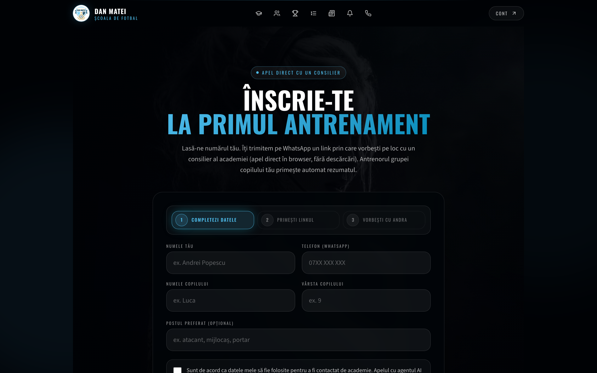<br/><sub><b>Booking</b> — lead form → instant AI WhatsApp call</sub></td>
    <td width="50%">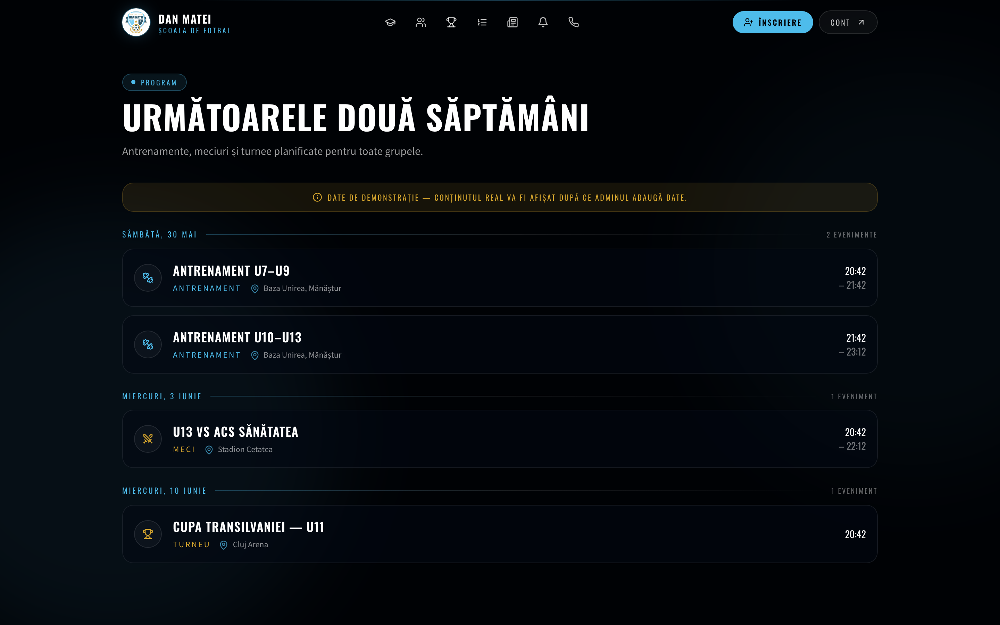<br/><sub><b>Schedule</b> — rolling 14-day training & match calendar</sub></td>
  </tr>
  <tr>
    <td width="50%">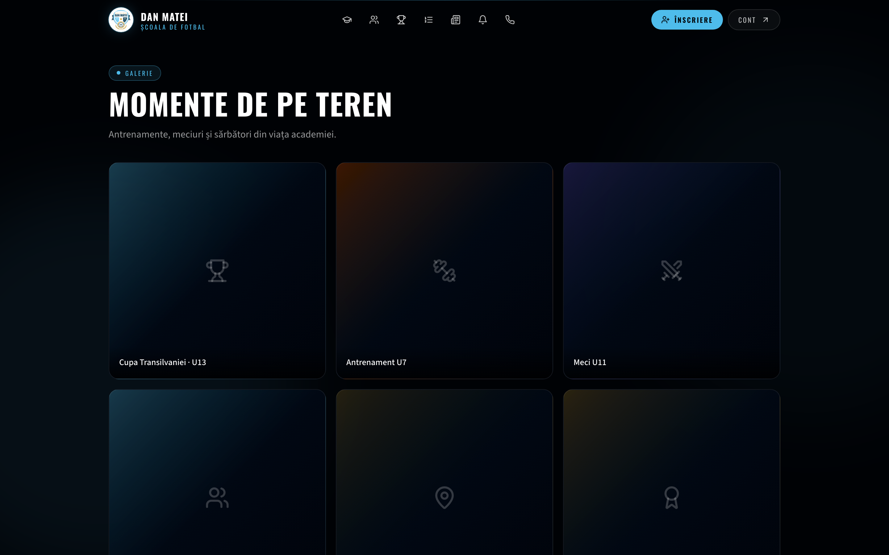<br/><sub><b>Gallery</b> — moments from the pitch</sub></td>
    <td width="50%">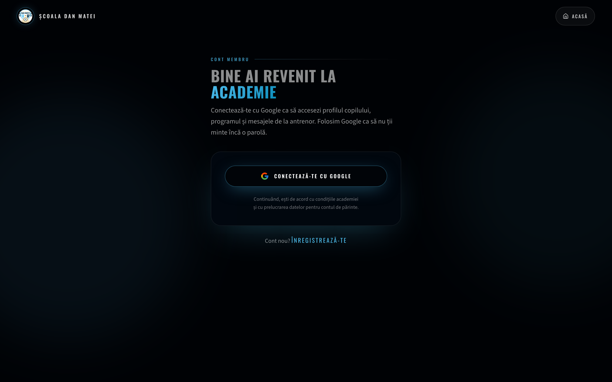<br/><sub><b>Member access</b> — Google sign-in</sub></td>
  </tr>
  <tr>
    <td width="50%">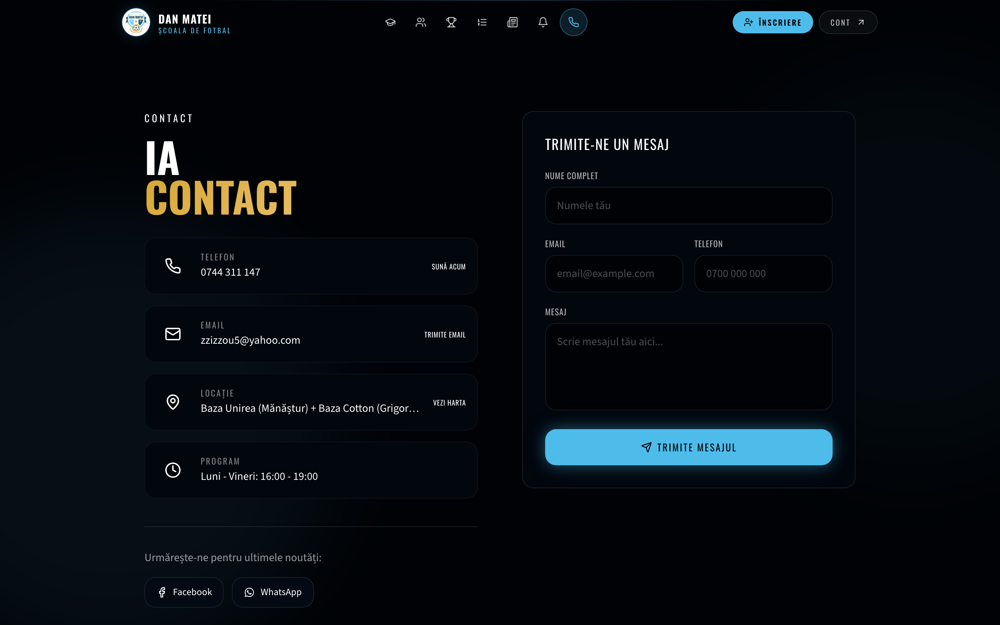<br/><sub><b>Contact</b> — phone, email, bases & socials</sub></td>
    <td width="50%" align="center">
      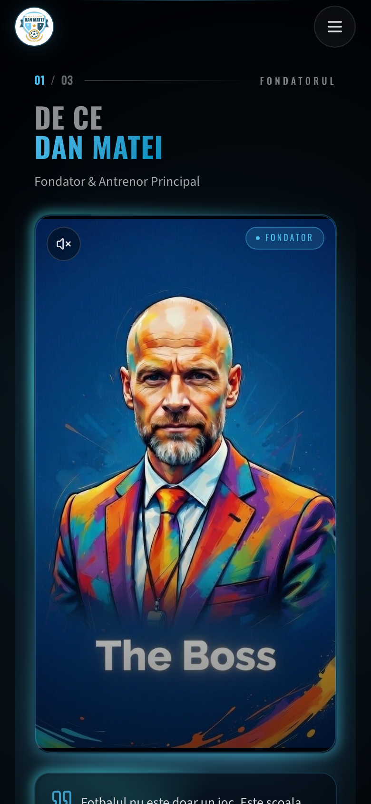
      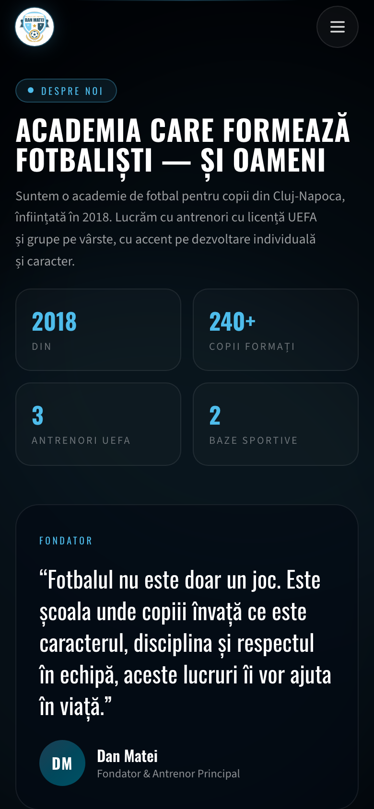<br/>
      <sub><b>Mobile-first</b> — installable PWA</sub>
    </td>
  </tr>
</table>

---

## 📞 Signature Feature — the AI voice agent

The most distinctive part of the platform turns a web lead into a **live AI phone-style conversation**, then routes a clean summary to the right coach. No human picks up the first call.

```
Parent submits /programare form
        │
        ▼
/api/lead/create ──► routes coach by child age ──► sends one-tap WhatsApp link (Evolution API / Meta Cloud)
        │
        ▼
Parent opens /apel/<signed-token>  ──►  mic + speaker pre-flight checks
        │
        ▼
/api/voice/start  ──► mints LiveKit room JWTs + auto-dispatches the agent
        │
        ▼
"Andra"  ──►  Deepgram STT (RO)  ►  LLM  ►  ElevenLabs TTS   (LiveKit WebRTC, real-time)
        │
        ▼
/api/voice/webhook  ──► transcript + summary + intent + next-steps  ──► coach inbox + push + WhatsApp
```

The agent (`services/voice-agent/agent.py`) is a **LiveKit Agents** Python worker deployed on **Fly.io** (Frankfurt). Tokens are minted securely server-side; lead links are **HMAC-signed**. The same OpenAI-compatible LLM layer also drafts training recaps, weekly news posts and coach reply messages.

---

## 🛠️ Tech Stack

| Layer                | Technology                                                                                                              |
| -------------------- | ----------------------------------------------------------------------------------------------------------------------- |
| **Frontend**         | React **19**, Vite **7**, TypeScript 5.6, [wouter](https://github.com/molefrog/wouter) routing                          |
| **Styling / UI**     | Tailwind CSS **v4**, [shadcn/ui](https://ui.shadcn.com) (53 components) on Radix UI, `lucide-react`, `framer-motion`    |
| **Forms / data viz** | React Hook Form + Zod, Embla Carousel, Recharts, Sonner toasts                                                          |
| **Backend (data)**   | [Supabase](https://supabase.com) — Postgres + Auth + Storage + Realtime (dedicated `fotbal` schema, RLS on every table) |
| **Backend (logic)**  | Vercel **serverless functions** (`/api`, `@vercel/node`); Express static host for self-hosting                          |
| **Voice AI**         | LiveKit (WebRTC + server SDK), a Python **LiveKit Agents** worker, Deepgram STT, ElevenLabs TTS/ConvAI                  |
| **Messaging**        | WhatsApp via Evolution API (self-host) or Meta Cloud API; Web Push (VAPID)                                              |
| **AI text**          | Provider-agnostic OpenAI-compatible LLM (OpenAI / Gemini / OpenRouter / local Ollama)                                   |
| **Tooling**          | pnpm 10, Node 22, Playwright + Vitest, Prettier, ESLint-free strict TS                                                  |
| **Hosting**          | Vercel (web + API + cron) · Fly.io / Docker (voice agent)                                                               |

---

## 🏗️ Architecture

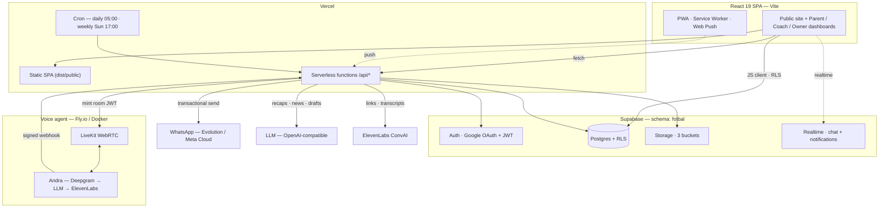

**Key design choices**

- **Single shared Supabase project**, isolated under a dedicated `fotbal` Postgres schema so it never collides with other apps' `public` tables.
- **RLS everywhere.** The browser talks to Postgres directly with the anon key; every privileged write (inviting coaches, fan-out notifications, lead routing) goes through `/api` with the service-role key.
- **Security-conscious by default** — HMAC-signed call links, server-minted LiveKit JWTs, signed webhooks, signed Storage URLs for private media.

---

## 📁 Project Structure

```
danmatei/
├── client/                  # React 19 SPA (Vite root)
│   ├── public/              # logo, PWA icons, hero videos, manifest, sw.js
│   └── src/
│       ├── pages/           # route components (Home, Cunoaste, Academie, Dashboard, Admin…)
│       ├── components/      # feature components
│       │   ├── cunoaste/    # the swipe-deck (SlideOwner / Trainers / Players)
│       │   ├── trainer/     # coach dashboard tabs + AI lead inbox
│       │   ├── admin/       # owner dashboard tabs + analytics
│       │   ├── player/      # child profile header + skills radar
│       │   ├── leads/       # lead-capture form
│       │   ├── notifications/
│       │   └── ui/          # shadcn/ui primitives (53)
│       ├── lib/             # supabase client, auth context, motion, whatsapp, hooks
│       ├── data/            # static landing content (owner, coaches, age groups)
│       └── contexts/
├── api/                     # Vercel serverless functions
│   ├── _lib/                # supabase, openai, elevenlabs, whatsapp, push helpers
│   ├── lead/  ai/  voice/   # lead funnel · ConvAI · LiveKit voice agent
│   ├── push/ messages/ news/ training/ schedule/ attendance/
│   └── cron/                # daily + weekly digest jobs
├── services/
│   ├── voice-agent/         # Python LiveKit Agents worker (Andra) + Dockerfile + fly.toml
│   ├── livekit/             # self-host LiveKit config
│   └── caddy/               # optional TLS reverse proxy
├── server/                  # minimal Express static host (self-hosting / Docker)
├── supabase/                # migrations (0001–0011) + seed
├── shared/                  # shared constants
├── e2e/                     # Playwright audits
├── docs/screenshots/        # README assets
├── docker-compose.yml       # self-hosted voice + WhatsApp stack
└── vercel.json              # build, rewrites, cron schedule
```

---

## 🗄️ Data Model

All tables live in the `fotbal` schema with **Row-Level Security enabled on every table**. Roles: `owner` · `super_admin` · `trainer` · `parent`.

| Domain              | Tables                                                                                                     |
| ------------------- | ---------------------------------------------------------------------------------------------------------- |
| **People**          | `profiles`, `trainers`, `children`, `groups`                                                               |
| **Activity**        | `schedule_events`, `match_results`, `match_participations`, `attendance`, `player_skills`, `player_events` |
| **Content**         | `news`, `media`, `landing_content`                                                                         |
| **Comms**           | `messages`, `notifications`, `chat_threads`, `chat_messages`, `push_subscriptions`                         |
| **AI lead funnel**  | `leads`, `lead_calls`, `lead_notifications`, `ai_conversations`                                            |
| **Views**           | `v_trainer_inbox`, `v_child_stats`                                                                         |
| **Storage buckets** | `fotbal-media-private` · `fotbal-trainer-public` · `fotbal-news-public`                                    |

---

## 🚀 Getting Started

### Prerequisites

- **Node 22.x** and **pnpm 10**
- A **Supabase** project (free tier is fine)
- _(optional, for AI/voice/WhatsApp features)_ LiveKit, ElevenLabs, Deepgram, an OpenAI-compatible key, and a WhatsApp gateway

### Install & run

```bash
git clone https://github.com/DansiDanutz/danmatei.git
cd danmatei
pnpm install

cp .env.example .env.local        # then fill in your Supabase URL + keys
pnpm dev                          # Vite dev server on http://localhost:3030
```

Other commands:

```bash
pnpm check        # tsc --noEmit (type-check)
pnpm test         # unit tests
pnpm test:e2e     # public/browser smoke tests
pnpm test:e2e:audit # slower public UX/interaction audit
pnpm build        # SPA → dist/public  +  bundles the Express host
pnpm preview      # preview the production build
pnpm format       # Prettier
```

### Database setup

Apply the migrations in `supabase/` to your project's `fotbal` schema:

```bash
supabase db push                  # via the Supabase CLI (preferred)
# — or — paste supabase/migrations/0001_*.sql … into the SQL editor in order
```

Promote your own account to owner so `/admin` opens:

```sql
update fotbal.profiles set role = 'owner'
where id = (select id from auth.users where email = 'YOUR_EMAIL');
```

---

## 🔑 Environment Variables

Only the **Supabase** group is required to boot the site. The rest progressively unlock AI, voice, WhatsApp and push features (each degrades gracefully with a `503` when unconfigured). In production, `LEAD_LINK_SIGNING_SECRET` is required for the AI-call lead flow so `/api/lead/create` can mint `/apel/<token>` links and `/api/voice/start` can verify them. See [`.env.example`](.env.example) for the full list.

<details>
<summary><b>Supabase (required)</b></summary>

| Variable                             | Purpose                                          |
| ------------------------------------ | ------------------------------------------------ |
| `VITE_SUPABASE_URL`                  | Project URL (browser)                            |
| `VITE_SUPABASE_ANON_KEY`             | Anon key (browser, RLS-bound)                    |
| `SUPABASE_URL` / `SUPABASE_ANON_KEY` | Server-side equivalents                          |
| `SUPABASE_SERVICE_ROLE`              | Service-role key — **server only**, bypasses RLS |
| `VITE_APP_URL`                       | App origin for invite / reset redirects          |
| `PUBLIC_BASE_URL`                    | Canonical public origin for generated links      |

</details>

<details>
<summary><b>AI · Voice · WhatsApp · Push (optional)</b></summary>

| Group           | Variables                                                                                                                                                                                                                                                  |
| --------------- | ---------------------------------------------------------------------------------------------------------------------------------------------------------------------------------------------------------------------------------------------------------- |
| **LiveKit**     | `LIVEKIT_URL`, `LIVEKIT_API_KEY`, `LIVEKIT_API_SECRET`, `LIVEKIT_AGENT_NAME`                                                                                                                                                                               |
| **Voice agent** | `DEEPGRAM_API_KEY`, `LIVEKIT_LLM_API_KEY` / `GEMINI_API_KEY`, `LIVEKIT_LLM_BASE_URL`, `LIVEKIT_LLM_MODEL`, `ELEVENLABS_API_KEY`, `ELEVEN_API_KEY`, `PIPECAT_WEBHOOK_SECRET`, `MAX_CALL_SECONDS`, `API_BASE`, `PUBLIC_BASE_URL`, `LEAD_LINK_SIGNING_SECRET` |
| **ElevenLabs**  | `ELEVENLABS_API_KEY`, `ELEVENLABS_DEFAULT_AGENT_ID`, `ELEVENLABS_WEBHOOK_SECRET`                                                                                                                                                                           |
| **LLM (text)**  | `OPENAI_API_KEY`, `OPENAI_BASE_URL`, `OPENAI_MODEL`                                                                                                                                                                                                        |
| **WhatsApp**    | `WHATSAPP_PHONE_ID`, `WHATSAPP_ACCESS_TOKEN`, `EVOLUTION_API_URL`, `EVOLUTION_API_KEY`, `EVOLUTION_API_INSTANCE`                                                                                                                                           |
| **Web Push**    | `VAPID_PUBLIC_KEY`, `VAPID_PRIVATE_KEY`, `VAPID_SUBJECT`                                                                                                                                                                                                   |
| **Cron**        | `CRON_SECRET`                                                                                                                                                                                                                                              |

> Never commit real secrets. `SUPABASE_SERVICE_ROLE` and all `*_SECRET` / private keys are server-only and must never be exposed to the browser.

</details>

---

## ☁️ Deployment

### Web + API (Vercel)

Push to a Vercel-linked branch. `vercel.json` is pre-configured:

- `vite build` → static SPA in `dist/public`
- `api/**/*.ts` → serverless functions
- **Cron:** daily birthday/RSVP, weekly digest, stale-call reaper, monthly charges, overdue closeout, schedule reminder, and coaching digest
- SPA rewrite for client-side routing; long-cache for `/assets/*`, no-cache for `index.html`

Set the environment variables (above) in **Vercel → Project Settings → Environment Variables**.
For production, set both `VITE_APP_URL` and `PUBLIC_BASE_URL` to
`https://www.danmatei.ro` so OAuth, trainer invites, WhatsApp call links,
assistant fallback links, sitemap and social metadata all use the custom domain.

### Voice agent (Fly.io / Docker)

The AI call agent runs separately from the web app:

```bash
cd services/voice-agent
fly deploy            # Frankfurt, always-on machine
# — or, local stack (LiveKit + voice worker + Evolution + Caddy):
docker compose up -d
```

---

## 📜 Scripts

| Command               | Description                                                                 |
| --------------------- | --------------------------------------------------------------------------- |
| `pnpm dev`            | Vite dev server (`http://localhost:3030`)                                   |
| `pnpm build`          | Production build (SPA + bundled Express host)                               |
| `pnpm start`          | Run the production server                                                   |
| `pnpm preview`        | Preview the production build                                                |
| `pnpm check`          | Type-check with `tsc --noEmit`                                              |
| `pnpm test`           | Unit tests                                                                  |
| `pnpm test:e2e`       | Public Playwright smoke tests                                               |
| `pnpm test:e2e:audit` | Slower public UX/interaction audit with screenshots and reports             |
| `pnpm test:e2e:roles` | Local Supabase Playwright smoke for owner, trainer and parent seed accounts |
| `pnpm format`         | Format with Prettier                                                        |

`pnpm test:e2e:roles` expects the local Supabase stack to be running and seeded
(`supabase start && supabase db reset --local`). It reads the local API URL and
publishable key from `supabase status -o env`; no production secrets are needed.

---

## 📐 Project Conventions

- All UI strings are **Romanian (RO)**.
- Brand identity is **equipment-cyan** (`#5ECBF2`). **Gold** (`#D4A843`) is reserved for _achievement_ signals only — trophies, UEFA license, certifications.
- Typography: **Oswald** (condensed display) + **Source Sans 3** (body). Dark theme throughout.
- The landing animation budget is a deliberate **10-second** auto-redirect (`HERO_REDIRECT_MS`); honors `prefers-reduced-motion`.
- Private media is served through **signed Storage URLs** — never expose private bucket paths in the browser.
- Every DB write outside RLS scope (creating coaches, fan-out notifications, lead routing) lives in `/api` and uses `serviceClient()`.
- Accessibility targets: 4.5:1 contrast, 44px touch targets.

---

## 📄 License

[MIT](LICENSE) © A.C.S. Școala de Fotbal Dan Matei

<div align="center">
<br/>
<sub>Built with ⚽ in Cluj-Napoca · <a href="https://www.danmatei.ro">www.danmatei.ro</a></sub>
</div>
